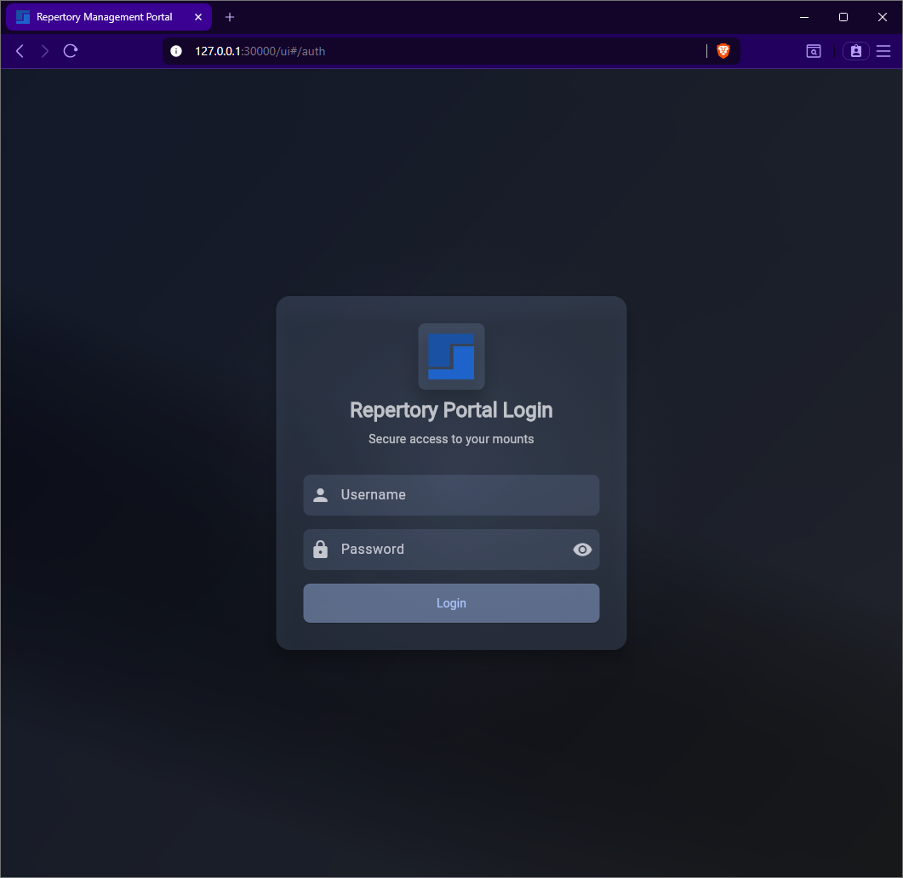
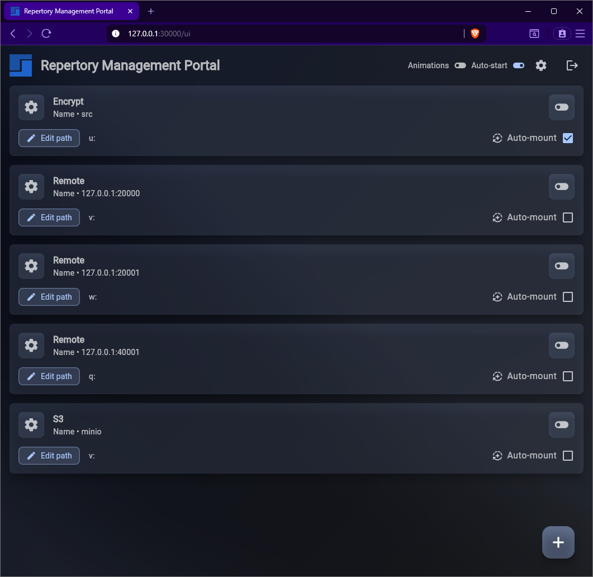

# Repertory
> /rĕp′ər-tôr″ē/  
> noun  
> *A place, such as a storehouse, where a stock of things is kept; a repository*

Repertory allows you to mount **S3** and **Sia** storage as local drives using:

- **FUSE** (Linux/macOS)
- **WinFSP** (Windows)

It supports:

- Local mounts
- Remote encrypted mounts between systems
- Optional file name and data encryption using `XChaCha20-Poly1305` and `Argon2id` for key generation

---

## 📖 Contents

1. [Quick Start (Sia Example)](#-quick-start-sia-example)
2. [Details & Features](#-details-and-features)
3. [Minimum Requirements](#-minimum-requirements)
   - [Supported Operating Systems](#supported-operating-systems)
4. [Data Directories](#-data-directories)
5. [GUI](#-gui)
6. [Usage](#-usage)
   - [Important Options](#important-options)
   - [Unmounting](#unmounting)
7. [Sia Setup](#-sia)
   - [Sia Initial Configuration](#sia-initial-configuration)
   - [Sia Mounting](#sia-mounting)
   - [Sia Configuration File](#sia-configuration-file)
8. [S3 Setup](#-s3)
   - [S3 Initial Configuration](#s3-initial-configuration)
   - [S3 Mounting](#s3-mounting)
   - [S3 Configuration File](#s3-configuration-file)
9. [Remote Mounting](#-remote-mounting)
   - [Server Setup](#server-setup)
   - [Client Setup](#client-setup)
   - [Remote Mount Configuration File](#remote-mount-configuration-file)
10. [Compiling from Source](#-compiling)
    - [Linux Compilation](#linux-compilation)
    - [macOS Compilation](#macos-compilation)
    - [Windows Compilation](#windows-compilation)
11. [Credits](#-credits)
12. [Developer Public Key](#-developer-public-key)
13. [Consult the Wiki for additional information](https://git.fifthgrid.com/BlockStorage/repertory/wiki)

---

## 🚀 Quick Start (Sia Example)

> 💡 Want to mount S3 instead?  
> Skip ahead to [S3 Setup](#-s3) — the process is almost identical.

This example mounts a Sia bucket from a running [renterd](https://github.com/SiaFoundation/renterd) instance.

---

### 1. Install dependencies

#### Linux

``` shell
sudo apt install fuse3   # Debian/Ubuntu
# or
sudo dnf install fuse3   # Fedora
```

#### macOS

- Install [macFUSE 4.10.2](https://github.com/macfuse/macfuse/releases/download/macfuse-4.10.2/macfuse-4.10.2.dmg)

#### Windows

- Install [WinFSP 2025](https://github.com/winfsp/winfsp/releases/download/v2.1/winfsp-2.1.25156.msi)

---

### 2. Configure

Replace placeholders with your actual values:

``` shell
repertory --name mybucket -set HostConfig.ApiPassword "<renterd api password>"
repertory --name mybucket -set SiaConfig.Bucket "<bucket name>"
```

Optional:

``` shell
# If renterd is not running locally
repertory --name mybucket -set HostConfig.HostNameOrIp "<hostname or IP>"

# If renterd uses a non-default port (default 9980)
repertory --name mybucket -set HostConfig.ApiPort <port>
```

---

### 3. Mount

<!-- markdownlint-disable-next-line -->
#### Linux

``` shell
repertory --name mybucket /mnt/mybucket
```

<!-- markdownlint-disable-next-line -->
#### macOS

``` shell
repertory --name mybucket /Volumes/mybucket
```

<!-- markdownlint-disable-next-line -->
#### Windows

``` shell
repertory --name mybucket t:
```

---

### 4. Unmount

``` shell
repertory --name mybucket --unmount
```

---

## ✨ Details and Features

- **Optimized for [Plex Media Server](https://www.plex.tv/).**
- Remote mounting of `repertory` instances between Linux, macOS, and/or Windows.
  - Securely share your mounts over TCP/IP via `XChaCha20-Poly1305` with other systems on your network or over the internet.
- Cross-platform support (Linux, macOS, and Windows).
- Optionally encrypt file names and file data via `XChaCha20-Poly1305` in S3 mounts.

---

## 📋 Minimum Requirements

- **Sia:** [renterd](https://github.com/SiaFoundation/renterd/releases) v2.0.0+ for Sia support
- **Linux:** requires `fusermount3`; otherwise, `repertory` must be manually compiled with `libfuse2` support
- **macOS:** requires:
  - [macFUSE 4.10.2](https://github.com/macfuse/macfuse/releases/download/macfuse-4.10.2/macfuse-4.10.2.dmg)
- **Windows:** requires:
  - [WinFSP 2025](https://github.com/winfsp/winfsp/releases/download/v2.1/winfsp-2.1.25156.msi)

### Supported Operating Systems

Only **64-bit operating systems** are supported:

- Linux `arm64/aarch64`
- Linux `x86_64`
- macOS `arm64/aarch64`
- macOS `x86_64`
- Windows `x86_64` 10, 11

---

## 📂 Data Directories

<!-- markdownlint-disable-next-line -->
### Linux

``` shell
~/.local/repertory2/s3
~/.local/repertory2/sia
```

<!-- markdownlint-disable-next-line -->
### Windows

``` shell
%LOCALAPPDATA%\repertory2\s3
%LOCALAPPDATA%\repertory2\sia
```

**IMPORTANT:**  
It is highly recommended to **exclude** these folders from any anti-virus/anti-malware applications as severe performance issues may arise. Excluding the mounted drive letter is also highly recommended.

---

## 🖥 GUI

As of `v2.0.6-release`, mounts can be managed using the **Repertory Management Portal**.

Launch the portal:

``` shell
repertory -ui
```

### ⚠️ Security tip

- Change the default UI credentials on first launch (`ui.json`) or via the portal
- Default username: `repertory`
- Default password: `repertory`

After first launch, `ui.json` will be created in the appropriate data directory (see [Data Directories](#-data-directories)). Modify this file directly or use the portal to change the default credentials.

### Screenshots

#### Login screen



#### Home screen



---

## 🛠 Usage

### Important Options

- `--help`  
  Display all mount utility options.

- `-f`  
  Keep process in foreground on Linux.

- `--name, -na [name]`  
  Identifies a unique configuration name to support multiple mounts.  
  The `--name` option can be set to any valid value allowed as a file name for your filesystem.  
  **The `--name` option is required.**

- `-dc`  
  Display mount configuration.  
  For Sia, the `--name` option is required.  
  For S3, the `-s3` and `--name` options are required.

### Unmounting

#### Remote

``` shell
repertory -rm 192.168.0.1:20000 --unmount
```

#### S3

``` shell
repertory -s3 --name '<my config name>' --unmount
```

#### Sia

``` shell
repertory --name '<my config name>' --unmount
```

---

## 🔒 Security Best Practices

When enabling **encryption tokens** for S3 or remote mounts:

- Use a **long, random string**.
- Store it **offline** (password manager and an offline backup).
- Losing it means **permanent data loss**.

---

## ☁️ Sia

### Sia Initial Configuration

**Required steps:**

- Set the appropriate bucket name and `renterd` API password in `repertory` configuration:

``` shell
repertory --name '<my config name>' -set HostConfig.ApiPassword '<my password>'
repertory --name '<my config name>' -set SiaConfig.Bucket '<my bucket name>'
```

**Optional steps:**

- Set a user name used during `renterd` basic authentication:

``` shell
repertory --name '<my config name>' -set HostConfig.ApiUser '<my user>'
```

- Set a custom agent string (default `Sia-Agent`):

``` shell
repertory --name '<my config name>' -set HostConfig.AgentString '<my agent>'
```

- Set the host name or IP of the `renterd` instance (default `localhost`):

``` shell
repertory --name '<my config name>' -set HostConfig.HostNameOrIp '<my host name>'
```

- Set the `renterd` API port (default `9980`):

``` shell
repertory --name '<my config name>' -set HostConfig.ApiPort 9981
```

**Verify/view all configuration options:**

``` shell
repertory --name '<my config name>' -dc
# Example:
repertory --name my_bucket -dc
```

### Sia Mounting

<!-- markdownlint-disable-next-line -->
#### Linux

``` shell
repertory --name '<my config name>' /mnt/location
# Example:
repertory --name my_bucket /mnt/location
```

<!-- markdownlint-disable-next-line -->
#### macOS

``` shell
repertory --name '<my config name>' /Volumes/mybucket
# Example:
repertory --name my_bucket /Volumes/mybucket
```

<!-- markdownlint-disable-next-line -->
#### Windows

``` shell
repertory --name '<my config name>' t:
# Example:
repertory --name my_bucket t:
```

### Sia Configuration File

```json
{
  "ApiPassword": "<random generated rpc password>",
  "ApiPort": 10000,
  "ApiUser": "repertory",
  "DatabaseType": "rocksdb",
  "DownloadTimeoutSeconds": 30,
  "EnableDownloadTimeout": true,
  "EnableDriveEvents": false,
  "EventLevel": "info",
  "EvictionDelayMinutes": 1,
  "EvictionUseAccessedTime": false,
  "HighFreqIntervalSeconds": 30,
  "HostConfig": {
    "AgentString": "Sia-Agent",
    "ApiPassword": "<renterd api password>",
    "ApiPort": 9980,
    "ApiUser": "",
    "HostNameOrIp": "localhost",
    "Path": "",
    "Protocol": "http",
    "TimeoutMs": 60000
  },
  "LowFreqIntervalSeconds": 3600,
  "MaxCacheSizeBytes": 21474836480,
  "MaxUploadCount": 5,
  "MedFreqIntervalSeconds": 120,
  "OnlineCheckRetrySeconds": 60,
  "PreferredDownloadType": "default",
  "RemoteMount": {
    "ApiPort": 20000,
    "ClientPoolSize": 20,
    "Enable": false,
    "EncryptionToken": ""
  },
  "RetryReadCount": 6,
  "RingBufferFileSize": 512,
  "SiaConfig": {
    "Bucket": "my_bucket"
  },
  "TaskWaitMs": 100,
  "Version": 1
}
```

---

## 🪣 S3

### S3 Initial Configuration

**Required steps:**

- Set the appropriate base URL:

``` shell
repertory -s3 --name '<my config name>' -set S3Config.URL '<my url>'
# Example:
repertory -s3 --name minio -set S3Config.URL 'http://localhost:9000'
```

- Set the appropriate bucket name:

``` shell
repertory -s3 --name '<my config name>' -set S3Config.Bucket '<my bucket name>'
```

- Set the appropriate access key:

``` shell
repertory -s3 --name '<my config name>' -set S3Config.AccessKey '<my access key>'
```

- Set the appropriate secret key:

``` shell
repertory -s3 --name '<my config name>' -set S3Config.SecretKey '<my secret key>'
```

- For Sia and most local S3 gateway instances, enable path style URLs:

``` shell
repertory -s3 --name '<my config name>' -set S3Config.UsePathStyle true
```

**Optional steps:**

- Set an appropriate region. Default is `any`:

``` shell
repertory -s3 --name '<my config name>' -set S3Config.Region '<my region>'
```

- Enable encrypted file names and file data. Set a strong, random encryption token and store it securely:

``` shell
repertory -s3 --name '<my config name>' -set S3Config.EncryptionToken '<my strong password>'
```

**Verify/view all configuration options:**

``` shell
repertory -s3 --name '<my config name>' -dc
# Example:
repertory -s3 --name minio -dc
```

### S3 Mounting

<!-- markdownlint-disable-next-line -->
#### Linux

``` shell
repertory -s3 --name '<my config name>' /mnt/location
# Example:
repertory -s3 --name minio /mnt/location
```

<!-- markdownlint-disable-next-line -->
#### macOS

``` shell
repertory -s3 --name '<my config name>' /Volumes/minio
# Example:
repertory -s3 --name minio /Volumes/minio
```

<!-- markdownlint-disable-next-line -->
#### Windows

``` shell
repertory -s3 --name '<my config name>' t:
# Example:
repertory -s3 --name minio t:
```

### S3 Configuration File

```json
{
  "ApiPassword": "<random generated rpc password>",
  "ApiPort": 10100,
  "ApiUser": "repertory",
  "DatabaseType": "rocksdb",
  "DownloadTimeoutSeconds": 30,
  "EnableDownloadTimeout": true,
  "EnableDriveEvents": false,
  "EventLevel": "info",
  "EvictionDelayMinutes": 1,
  "EvictionUseAccessedTime": false,
  "HighFreqIntervalSeconds": 30,
  "LowFreqIntervalSeconds": 3600,
  "MaxCacheSizeBytes": 21474836480,
  "MaxUploadCount": 5,
  "MedFreqIntervalSeconds": 120,
  "OnlineCheckRetrySeconds": 60,
  "PreferredDownloadType": "default",
  "RemoteMount": {
    "ApiPort": 20100,
    "ClientPoolSize": 20,
    "Enable": false,
    "EncryptionToken": ""
  },
  "RetryReadCount": 6,
  "RingBufferFileSize": 512,
  "S3Config": {
    "AccessKey": "<my access key>",
    "Bucket": "<my bucket name>",
    "EncryptionToken": "",
    "Region": "any",
    "SecretKey": "<my secret key>",
    "TimeoutMs": 60000,
    "URL": "http://localhost:9000",
    "UsePathStyle": true,
    "UseRegionInURL": false
  },
  "TaskWaitMs": 100,
  "Version": 1
}
```

---

## 🌐 Remote Mounting

`repertory` allows local mounts to be shared with other computers on your network or over the internet. This option is referred to as **remote mounting**.

### Server Setup

The following steps must be performed on the mount you wish to share with other systems. Changes to configuration will not take effect while a mount is active, so it is recommended to unmount beforehand.

**Required steps:**

- Enable remote mount:

  - **Sia**

    ``` shell
    repertory -set RemoteMount.Enable true
    repertory --name '<my config name>' -set RemoteMount.Enable true
    ```

  - **S3**

    ``` shell
    repertory -set RemoteMount.Enable true
    repertory -s3 --name '<my config name>' -set RemoteMount.Enable true
    ```

- Set a secure encryption token:

  - **Sia**

    ``` shell
    repertory -set RemoteMount.EncryptionToken '<my secure password>'
    repertory --name '<my config name>' -set RemoteMount.EncryptionToken '<my secure password>'
    ```

  - **S3**

    ``` shell
    repertory -s3 --name '<my config name>' -set RemoteMount.EncryptionToken '<my secure password>'
    ```

**Optional steps:**

- Change the port clients will use to connect to your mount:

  - **Sia**

    ``` shell
    repertory -set RemoteMount.ApiPort 20000
    repertory --name '<my config name>' -set RemoteMount.ApiPort 20000
    ```

  - **S3**

    ``` shell
    repertory -s3 --name '<my config name>' -set RemoteMount.ApiPort 20000
    ```

**IMPORTANT:**  

Be sure to configure your firewall to allow incoming TCP connections on the port configured in `RemoteMount.ApiPort`.

#### Remote Mount Configuration File Section

```json
{
  "RemoteMount": {
    "ApiPort": 20000,
    "ClientPoolSize": 20,
    "Enable": true,
    "EncryptionToken": "<my secure password>"
  }
}
```

### Client Setup

Client configuration is provider agnostic, so there's no need to specify `-s3` for S3 providers.

**Required steps:**

- Set the encryption token to the same value configured during server setup:

``` shell
repertory -rm <host name or IP>:<port> -set RemoteConfig.EncryptionToken '<my secure password>'
# Replace <host name or IP> with the host name or IP of the server
# Replace <port> with the value of RemoteMount.ApiPort used in the server configuration
# Example:
repertory -rm 192.168.1.10:20000 -set RemoteConfig.EncryptionToken '<my secure password>'
repertory -rm my.host.com:20000 -set RemoteConfig.EncryptionToken '<my secure password>'
```

#### Client Remote Mounting

<!-- markdownlint-disable-next-line -->
##### Linux

``` shell
repertory -rm <host name or IP>:<port> /mnt/location
# Example:
repertory -rm 192.168.1.10:20000 /mnt/location
```

<!-- markdownlint-disable-next-line -->
##### macOS

``` shell
repertory -rm <host name or IP>:<port> /Volumes/remotemount
# Example:
repertory -rm 192.168.1.10:20000 /Volumes/remotemount
```

<!-- markdownlint-disable-next-line -->
##### Windows

``` shell
repertory -rm <host name or IP>:<port> t:
# Example:
repertory -rm 192.168.1.10:20000 t:
```

#### Remote Mount Configuration File

```json
{
  "ApiPassword": "<random generated rpc password>",
  "ApiPort": 10010,
  "ApiUser": "repertory",
  "EnableDriveEvents": false,
  "EventLevel": "info",
  "RemoteConfig": {
    "ApiPort": 20000,
    "EncryptionToken": "<my secure password>",
    "HostNameOrIp": "192.168.1.10",
    "MaxConnections": 20,
    "ReceiveTimeoutMs": 120000,
    "SendTimeoutMs": 30000
  },
  "TaskWaitMs": 100,
  "Version": 1
}
```

---

## 🧰 Compiling

Successful compilation will place all required files for execution in the `dist/` directory.

### Linux Compilation

- Ensure `docker` is installed

- For `x86_64`:

  ``` shell
  scripts/make_unix.sh x86_64
  scripts/make_unix.sh x86_64 Release
  scripts/make_unix.sh x86_64 Debug
  ```

- For `aarch64`:

  ``` shell
  scripts/make_unix.sh aarch64
  scripts/make_unix.sh aarch64 Release
  scripts/make_unix.sh aarch64 Debug
  ```

### macOS Compilation

- Ensure `Xcode` and `CMake` are installed

- For `x86_64`:

  ``` shell
  scripts/make_unix.sh x86_64
  scripts/make_unix.sh x86_64 Release
  scripts/make_unix.sh x86_64 Debug
  ```

- For `aarch64`:

  ``` shell
  scripts/make_unix.sh aarch64
  scripts/make_unix.sh aarch64 Release
  scripts/make_unix.sh aarch64 Debug
  ```

### Windows Compilation

- **OFFICIAL: Cross-compiling on Linux**

  - Ensure `docker` is installed

    ``` shell
    scripts/make_win32.sh x86_64
    scripts/make_win32.sh x86_64 Release
    scripts/make_win32.sh x86_64 Debug
    ```

- **UNOFFICIAL: Compiling on Windows**

  - Ensure latest [MSYS2](https://www.msys2.org/) is installed

    ``` shell
    scripts\make_win32.cmd x86_64
    scripts\make_win32.cmd x86_64 Release
    scripts\make_win32.cmd x86_64 Debug
    ```

---

## 📜 Credits

- [binutils](https://www.gnu.org/software/binutils/)
- [boost c++ libraries](https://www.boost.org/)
- [cpp-httplib](https://github.com/yhirose/cpp-httplib)
- [curl](https://curl.haxx.se/)
- [docker](https://www.docker.com/)
- [Google Test](https://github.com/google/googletest)
- [ICU](https://icu.unicode.org/)
- [JSON for Modern C++](https://github.com/nlohmann/json)
- [libexpat](https://github.com/libexpat/libexpat)
- [libfuse](https://github.com/libfuse/libfuse)
- [libsodium](https://doc.libsodium.org/)
- [macFUSE](https://macfuse.github.io/)
- [mingw-w64](https://www.mingw-w64.org/)
- [MSYS2](https://www.msys2.org)
- [OpenSSL](https://www.openssl.org/)
- [pkg-config](https://www.freedesktop.org/wiki/Software/pkg-config/)
- [pugixml](https://pugixml.org/)
- [RocksDB](https://rocksdb.org)
- [ScPrime](https://scpri.me/)
- [Sia Decentralized Cloud Storage](https://sia.tech/)
- [spdlog](https://github.com/gabime/spdlog)
- [SQLite](https://www.sqlite.org)
- [stduuid](https://github.com/mariusbancila/stduuid)
- [Storj](https://www.storj.io/)
- [WinFSP - FUSE for Windows](https://github.com/billziss-gh/winfsp)
- [zlib](https://zlib.net/)

---

## 🔑 Developer Public Key

```text
-----BEGIN PUBLIC KEY-----
MIICIjANBgkqhkiG9w0BAQEFAAOCAg8AMIICCgKCAgEAqXedleDOugdk9sBpgFOA
0+MogIbBF7+iXIIHv8CRBbrrf8nxLSgQvbHQIP0EklebDgLZRgyGI3SSQYj7D957
uNf1//dpkELNzfuezgAyFer9+iH4Svq46HADp5k+ugaK0mMDZM7OLOgo7415/+z4
NIQopv8prMFdxkShr4e4dpR+S6LYMYMVjsi1gnYWaZJMWgzeZouXFSscS1/XDXSE
vr1Jfqme+RmB4Q2QqGcDrY2ijumCJYJzQqlwG6liJ4FNg0U3POTCQDhQmuUoEJe0
/dyiWlo48WQbBu6gUDHbTCCUSZPs2Lc9l65MqOCpX76+VXPYetZgqpMF4GVzb2y9
kETxFNpiMYBlOBZk0I1G33wqVmw46MI5IZMQ2z2F8Mzt1hByUNTgup2IQELCv1a5
a2ACs2TBRuAy1REeHhjLgiA/MpoGX7TpoHCGyo8jBChJVpP9ZHltKoChwDC+bIyx
rgYH3jYDkl2FFuAUJ8zAZl8U1kjqZb9HGq9ootMk34Dbo3IVkc2azB2orEP9F8QV
KxvZZDA9FAFEthSiNf5soJ6mZGLi0es5EWPoKMUEd9tG5bP980DySAWSSRK0AOfE
QShT/z7oG79Orxyomwrb8ZJCi7wEfcCuK1NWgqLVUgXhpi2J9WYS6DAbF3Oh3Hhl
DYSHlcfFBteqNDlR2uFInIECAwEAAQ==
-----END PUBLIC KEY-----
```

